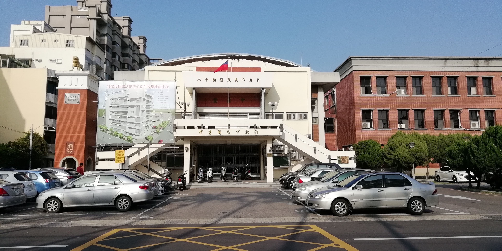

<h1 style="display: flex; align-items: center; gap: 0.6rem; margin-bottom: 0.2rem;">
  
  <span>From Caption Search to Rich Media Retrieval</span>
</h1>

## *AfterSight: extracting structured signals from images and reusing them for richer media retrieval.*

**Link to Repo:** [Media Search Engine](https://github.com/indianeagle4599/Media-Search-Engine)

Most image search systems flatten an image into a caption and stop there. That works well enough for broad semantic recall, but it also throws away a lot of useful signal.

Images carry visible text, contextual clues, embedded metadata, time information, and small details that matter depending on what the user is actually looking for. A single caption can hint at some of that, but it usually does not preserve it in a way that supports deliberate retrieval later.

AfterSight came from a simpler idea: if image understanding is expensive, it should happen once. After that, search should mostly be a retrieval problem. Instead of repeatedly asking a model to reinterpret the same image, I wanted one pass to produce a structured record that could be stored and searched many different ways later.

That is where the name comes from. **AfterSight** is about everything that happens after that first pass. The current implementation is image-first, but the indexing and retrieval design is meant to go beyond images: storing reusable retrieval signals instead of relying on one flat caption or one opaque search index.

This article follows the system in the same order the data moves through it: ingestion, analysis, indexing, and finally retrieval. The expensive step is up front. The useful part is what becomes possible after that.

## Ingestion: Turning Files into Searchable Candidates

The first job is not search. It is making sure the files entering the system are clean, consistent candidates for later retrieval.

I've setup AfterSight to support two practical entry points. Through the UI, I can upload images directly and let them move through the processing queue there.

<figure>
  
  <figcaption style="text-align: center;">Upload files and manage processing queues via UI</figcaption>
</figure>

If running the system locally, I can point the code at a root folder and index everything under it. Those are different entry paths, but they converge quickly into the same internal shape: one normalized record per file.

That normalization step is simple, but it matters. Before any model sees the image, the system has already cleaned the path, hashed the file, identified the media type, pulled out embedded metadata, and started building a stable record around it.

That file hash also does practical work later. It gives the system a stable identity for each asset, and it doubles as a deduplication key so repeated uploads do not need to trigger the whole pipeline again unnecessarily.

```python
def build_file_metadata(file_path: str, metadata_override: dict | None = None):
    file_path = os.path.abspath(os.path.normpath(file_path)).replace("\\", "/")
    file_hash = get_hash(file_path)

    metadata = {
        "file_hash": file_hash,
        "file_path": file_path,
        "file_name": os.path.basename(file_path),
        "media_type": media_type,
        "ext": file_ext,
        "mime_type": get_mime_type(file_path, media_type),
        "dates": {},
        "embedded_metadata": {},
    }

    embedded_metadata = get_embedded_metadata(file_path)
    extracted_date_items = embedded_metadata.pop("DateItems", {})
    metadata["dates"] = resolve_file_dates(file_path, extracted_date_items)
    metadata["embedded_metadata"] = embedded_metadata
```

For images, embedded metadata is not treated as an afterthought. EXIF and related tags often carry useful clues that a flat caption would never recover later. That is especially true for time. A single image can expose OS timestamps, original capture time, digitized time, modification time, and sometimes GPS-derived date information. Those values do not always agree, and when they do not, the disagreement itself becomes part of the signal.

Instead of trusting one timestamp blindly, AfterSight resolves those candidates into a cleaner `dates` object with a primary date, a better estimate of true creation and modification time, and a reliability signal attached to the result.

```python
def resolve_dates(dates: dict) -> dict:
    vals = {k: dates.get(k) for k in DATE_KEYS}
    created, modified, flags = _resolve_date_values(vals)

    return {
        "master_date": created or modified,
        "true_creation_date": created,
        "true_modification_date": modified,
        "index_date": vals["index_date"],
        "date_reliability": ...,
        "flags": flags,
    }
```

That extra work pays off later. Chronological retrieval is only useful if the system has already decided which date it should trust, how much it should trust it, and what it had to correct along the way. I did not want time-based search to be a thin filter layered on top of messy metadata. I wanted time to be a first-class retrieval signal, and that meant doing the normalization work early.

By the end of ingestion, each image is no longer just a file on disk. It has a stable identity, a normalized metadata record, and a cleaner set of facts ready for the more expensive analysis step.

For one actual image in the dataset:



After ingestion, the normalized record looks like this:

```json
{
  "file_hash": "c2a9c9bb...674dc40",
  "file_path": ".../images_root/uploads/20260413/c2a9c9bb...674dc40.jpg",
  "file_name": "2d3ffae4...cc732.jpg",
  "media_type": "image",
  "ext": "jpg",
  "mime_type": "image/jpeg",
  "is_compat": true,
  "uploaded_at": "2026-04-13T14:58:12.581875+08:00",
  "dates": {
    "master_date": "2018-12-22T14:32:17.915369+00:00",
    "true_creation_date": "2018-12-22T14:32:17.915369+00:00",
    "true_modification_date": "2026-04-13T06:58:15.633742+00:00",
    "creation_date": "2026-04-13T06:58:15.631652+00:00",
    "modification_date": "2026-04-13T06:58:15.633742+00:00",
    "index_date": "2026-04-13T14:58:42.622536+08:00",
    "date_reliability": "high",
    "flags": []
  },
  "embedded_metadata": {
    "Filename": "c2a9c9bb...674dc40.jpg",
    "Make": "HUAWEI",
    "Model": "FIG-LX2",
    "Software": "FIG-LX2 8.0.0.103(C636)",
    "DateTime": "2018:12:22 14:32:17",
    "ImageDescription": "dav",
    "GPSInfo": {
      "GPSLatitudeRef": "N",
      "GPSLatitude": [24, 50, 21.727752],
      "GPSLongitudeRef": "E",
      "GPSLongitude": [121, 0, 13.156127],
      "GPSAltitude": 40.94,
      "GPSTimeStamp": [6, 32, 17],
      "GPSDateStamp": "2018:12:22"
    },
    "Exif": {
      "DateTimeOriginal": "2018:12:22 14:32:17",
      "DateTimeDigitized": "2018:12:22 14:32:17",
      "ExposureTime": 0.000596,
      "FNumber": 2.2,
      "FocalLength": 3.21,
      "ISOSpeedRatings": 50,
      "ExifImageWidth": 4160,
      "ExifImageHeight": 2080
    }
  }
}
```

## Analysis: One-Pass Image Understanding

With cleaned up files and standardised metadata, I could now run one-pass VLM analysis on the images.

Analysis is where AfterSight spends real money. This is the step where the system asks a vision model, currently Gemini, to look at the image itself, connect it with the normalized metadata, and turn that combination into something more useful than a caption.

I did not want this step to be loose or open-ended. Images are prepared into batches, and each batch item carries an `entry_id`, its normalized metadata, and an analysis-sized image payload. Large images are resized before they go out, and the request is kept within an item limit and an inline byte budget. That keeps the expensive part bounded before the model sees it.

`rigor` is the main control knob here. It is not a cosmetic parameter. Lower rigor allows larger, cheaper batches. Higher rigor forces smaller batches and a more careful pass when the image needs it.

```python
DESCRIPTION_BATCH_SIZE_BY_RIGOR = {
    "very low": 50,
    "low": 20,
    "medium": 10,
    "high": 5,
    "very high": 2,
    "extreme": 1,
}
```

Just as important, I do not ask Gemini for a paragraph. I ask it for a record. The prompt forces one JSON result per image, split into `content` and `context`. `content` captures what is visibly there: summary, objects, OCR text, vibe, background, and detailed description. `context` ties that image back to intent, composition, dates, event, and metadata relevance. That split matters later because retrieval does not need to treat all text as the same kind of signal.

```python
response = client.models.generate_content(
    model=valid_entries[0]["metadata"].get("model_name"),
    contents=batch_request["contents"],
    config=genai.types.GenerateContentConfig(
        system_instruction=prompt_sections["admin"],
        response_mime_type="application/json",
    ),
)
```

Once a batch returns, AfterSight annotates the result with the analysis settings and writes it into MongoDB. Mongo acts as the master store for this step. It keeps the original metadata and the generated description together so the system does not have to pay for image understanding again on the next search. Because the stored key includes both the file identity and the model identity, separate analyses can coexist without overwriting each other.

The batch parser is also defensive. If Gemini returns partial JSON, the system salvages the complete items it can and flags the first unrecovered file instead of discarding the whole batch. That is a small detail, but it matters once you stop treating analysis as a toy step and start treating it like a production cost.

By the end of analysis, the image is no longer just metadata plus pixels. It has a reusable semantic record, still attached to the original file facts, ready to be split into retrieval-specific indexes.

For the same image, the stored analysis record looks like this:

```json
{
  "_id": "c2a9c9bb...674dc40_aa0a2eab...75779",
  "metadata": {
    "file_hash": "c2a9c9bb...674dc40",
    "file_name": "2d3ffae4...cc732.jpg",
    "media_type": "image",
    "mime_type": "image/jpeg",
    "dates": {
      "master_date": "2018-12-22T14:32:17.915369+00:00",
      "date_reliability": "high"
    },
    "model_hash": "aa0a2eab...75779",
    "api_name": "gemini",
    "model_name": "gemini-2.5-flash-lite"
  },
  "description": {
    "content": {
      "summary": "A photograph of a building with a prominent entrance, a national flag, and parked cars in front.",
      "objects": [
        "building",
        "flag",
        "cars",
        "motorcycles",
        "trees",
        "sign",
        "lion statue"
      ],
      "text": "竹北市市民活動中心綜合大樓新建工程\n\n心動 活來 民市北竹\n\n館圖國立市北竹",
      "vibe": ["neutral", "daytime"],
      "background": "urban",
      "detailed_description": "The image shows a civic building with a central entrance, flanked by stairs. A flag pole with a flag is visible on the roof. To the left, a brick tower features a lion statue at its apex and a large banner advertising a construction project. The foreground is a parking lot with several cars and some motorcycles parked near the building entrance. The sky is clear and blue, indicating daytime.",
      "miscellaneous": "The building appears to be a public facility, possibly a library or community center, given the Chinese text."
    },
    "context": {
      "primary_category": "Photography",
      "intent": "Personal/Candid",
      "composition": "Wide-angle",
      "estimated_date": "2018-12-22 14:32:17",
      "event": "Exterior shot of a public building, possibly a community center or library, with adjacent construction project signage and a parking lot.",
      "analysis": "The image provides a clear view of a public building, likely in Taiwan, given the Chinese text and flag. The presence of a construction banner suggests ongoing or recent development. The metadata indicates a creation date of December 22, 2018, which aligns with the clear daylight and seasonal appearance. The metadata is considered highly reliable.",
      "metadata_relevance": "The metadata strongly corroborates the visual content, particularly regarding the date and time of capture. The GPS information pinpoints the location to Taiwan."
    },
    "generation": {
      "rigor": "very low"
    }
  }
}
```

## Indexing: Turning One Record into Retrieval Surfaces

The Mongo record is rich, but it is still not the right shape for search.

A single JSON object can hold many useful signals, but it is a poor retrieval surface if everything gets flattened into one document and pushed into one collection. That is the point where indexing begins.

I do not treat indexing as a side effect of storage. I treat it as the step where the stored analysis is adapted into specialized search records, each built for a different kind of match.

```python
def build_entry_source_records(entry_object: dict) -> dict[str, dict]:
    metadata_object = entry_object.get("metadata") or {}
    absolute_fields = extract_metadata_fields(metadata_object).get("absolute", {})
    description_object = entry_object.get("description") or {}
    description_fragments = extract_description_fragments(description_object)

    source_records = {}
    for source_id, source_config in SearchManifest.SOURCES.items():
        field_fragments = {}
        for field_name in source_config["fields"]:
            field_value = description_fragments.get(field_name)
            if field_value:
                field_fragments[field_name] = field_value

        document = combine_field_fragments(field_fragments, source_config["text_mode"])
        metadata = {"source_id": source_id, "source_fields": list(field_fragments.keys())}
```

The important decision here is that one analysis record does not become one Chroma document. It becomes several. AfterSight currently defines five source collections:

```python
SOURCES = {
    "content_narrative": ["summary", "detailed_description", "miscellaneous", "background", "objects"],
    "context_narrative": ["event", "analysis", "other_details", "vibe"],
    "lexical_keywords": ["primary_category", "intent", "vibe", "composition", "background", "objects"],
    "ocr_content": ["ocr_text"],
    "other_data": ["metadata_relevance"],
}
```

Each collection serves a different retrieval job:

- `content_narrative` is for scene meaning.
- `context_narrative` is for event-level or situational understanding.
- `lexical_keywords` compresses category and attribute-like fields into a more keyword-friendly surface.
- `ocr_content` isolates visible text so text-heavy queries do not have to compete with narrative prose.
- `other_data` keeps smaller metadata-led hints searchable without polluting the stronger semantic collections.

That separation is what moves the system beyond caption search. Instead of one big text blob, the same image is stored as several deliberate retrieval surfaces, each with its own field mix, text mode, and search behavior. Sentence-like collections are embedded differently from word-like collections, and only the date-aware source carries the resolved absolute date fields needed later for chronological search.

Indexing also adds cheap structure that helps later retrieval. Token metadata is attached at upsert time so lexical search does not have to re-tokenize every stored document on the fly. Existing vectors are also left in place unless indexing is explicitly run with overwrite enabled, which makes the whole step incremental by default rather than rebuild-heavy.

For the same image, the indexed source records look roughly like this:

```json
{
  "content_narrative": {
    "source_fields": ["summary", "detailed_description", "miscellaneous", "background", "objects"]
  },
  "context_narrative": {
    "source_fields": ["event", "analysis", "vibe"],
    "date_field": "master_date"
  },
  "lexical_keywords": {
    "source_fields": ["primary_category", "intent", "vibe", "composition", "background", "objects"]
  },
  "ocr_content": {
    "source_fields": ["ocr_text"]
  },
  "other_data": {
    "source_fields": ["metadata_relevance"]
  }
}
```

By the end of indexing, AfterSight has stopped thinking in terms of files or even descriptions. It now has multiple purpose-built retrieval views of the same image, ready to be searched semantically, lexically, and, where relevant, chronologically.

## Retrieval: Letting Different Kinds of Match Compete

Once the records are indexed, search becomes much more deliberate.

I am no longer querying one caption field or one generic vector space. Each user query is normalized, tokenized, checked for date intent, and turned into a runtime plan that decides which sources to search, which search types to enable, and how much weight each of them should carry.

```python
def build_query_specs(query_texts: list) -> dict[str, dict]:
    normalized_query_text = normalize_query_text(query_text)
    date_info = extract_date_filter_from_query(normalized_query_text)
    clean_query_text = date_info.get("clean_query_text", "")
    token_metadata = tokenize_document(clean_query_text)
```

That planning step matters because the system is not doing one kind of search. It is doing several, and they are not all trying to answer the same question in the same way.

One indexed `context_narrative` record shows where those three search paths meet. The stored `document` gives semantic search something to embed, the token metadata supports lexical search, and the resolved date fields make chronological filtering possible on the same source.

```json
{
  "id": "c2a9c9bb...674dc40_aa0a2eab...75779",
  "collection": "context_narrative",
  "document": "Exterior shot of a public building, possibly a community center or library, with adjacent construction project signage and a parking lot.\nThe image provides a clear view of a public building, likely in Taiwan, given the Chinese text and flag.\nneutral, daytime",
  "metadata": {
    "source_id": "context_narrative",
    "source_fields": ["event", "analysis", "vibe"],
    "master_date": "2018-12-22T14:32:17.915369+00:00",
    "creation_date": "2018-12-22T14:32:17.915369+00:00",
    "modification_date": "2026-04-13T06:58:15.633742+00:00",
    "index_date": "2026-04-13T14:58:42.622536+08:00",
    "master_ts": 1545489137.915369,
    "creation_ts": 1545489137.915369,
    "modification_ts": 1776063495.633742,
    "index_ts": 1776063522.622536,
    "date_reliability": "high",
    "tokens": ["exterior", "shot", "public", "building", "community", "center", "library", "construction", "parking", "lot", "taiwan", "chinese", "text", "flag", "neutral", "daytime"],
    "token_string": "exterior shot public building community center library construction parking lot taiwan chinese text flag neutral daytime",
    "token_count": 16
  }
}
```

### Semantic Search

Semantic search is the broadest layer.

It is what lets a query like "public building with a flag and parked cars" match the right image even if the stored text does not repeat the query exactly. AfterSight runs semantic search separately on the collections that are meant to carry meaning, using the embedding family assigned to each source.

```text
query:    "public building with a flag and parked cars"
looks at: embedded meaning of the stored `document`
```

It also does not accept every nearest neighbor blindly. The semantic layer uses both an absolute distance limit and a dynamic tail limit relative to the best hit in that result set. That keeps weak semantic neighbors from leaking into the candidate pool just because a collection exists.

<figure>
  
  <figcaption style="text-align: center;">Semantic Search - "public building with a flag and parked cars"</figcaption>
</figure>

### Lexical Search

Lexical search is there for the cases where words matter more than paraphrase.

It works over tokenized stored documents and scores matches based on token overlap, query coverage, and exact phrase hits. That makes it useful for OCR fragments, attribute-style queries, category labels, and narrow intent matches where semantics alone can be too soft.

```text
query:    "community center taiwan flag"
looks at: `tokens` and `token_string`
```

Because token metadata is attached during indexing, this step stays fairly cheap. The system does not need to rebuild the token view of every document at query time before it can start matching.

<figure>
  <div style="display: flex; gap: 1rem; align-items: flex-start;">
    
    
  </div>
  <figcaption style="text-align: center;">Search "Agreement" for OCR-based lexical retrieval</figcaption>
</figure>

### Chronological Search

Chronological search only turns on when the query actually contains date intent.

If the query includes something like a year, month, season, or relative period, the retrieval plan extracts date filters and runs a separate chronological pass over the date-aware source. This is where the earlier date resolution work pays off.

```text
query:    "summer" or "morning"
looks at: `master_date`, `master_ts`, and `date_reliability`
```

Chronological matching uses the resolved date fields and their reliability, not raw filesystem timestamps alone. Specific date matches score better than vague ones, and high-reliability metadata gets a small bonus when the system has to decide between otherwise similar candidates.

<figure>
  <div style="display: flex; gap: 1rem; align-items: flex-start;">
    
    
  </div>
  <figcaption style="text-align: center;">Set high chronological priority and search "morning" for date-time based retrieval. Notice how "model is offloaded"? It's because we don't generate embeddings for this search.</figcaption>
</figure>

### Fusing the Results

After those searches run, the system still does not trust any single score scale enough to rank the final results directly.

Semantic distance, lexical coverage, and chronological specificity are not naturally comparable numbers. So instead of trying to normalize them into one fake universal score, AfterSight merges ranked lists with weighted Reciprocal Rank Fusion.

```python
rrf_score = weight / (int(row["rank"]) + rrf_smoothing)
total_score = sum(contribution["rrf_score"] for contribution in contributions)
```

That is a better fit for this kind of retrieval. If an image keeps appearing near the top across different sources and search types, it rises. If it only does well in one narrow lane, it still gets credit, but not enough to dominate unfairly.

```text
semantic ranks:  image A #1, image B #2
lexical ranks:   image B #1, image A #3
chrono ranks:    image A #2

RRF view:
image A -> support from semantic + lexical + chrono
image B -> support from semantic + lexical

image A wins because it stays near the top across more lanes.
```

The weights come from the retrieval plan itself, which means presets, focus controls, capability boosts, and source overrides can all change how much each signal matters without rewriting the search code.

That layered design is one of the parts I care about most. It makes the current UI more useful, but it also leaves room for better query orchestration later.

A RAG system or an agent does not need to replace retrieval here. It just needs to steer it better: choose sources more intentionally, tune focus, or ask for a narrower combination of semantic, lexical, and chronological evidence depending on the user's real intent.

## Practical Tradeoffs

Some of the choices in AfterSight are less about elegance and more about being thrifty.

- **Pay once, search many times.** The VLM analysis step is the expensive one. That is why the output is persisted in MongoDB and reused, instead of asking the model to reinterpret the same image on every search.
- **Batch Gemini where it makes sense.** The analysis step is not only one-pass, it is batched. That keeps the costlier vision-model work denser and more efficient than treating every image as an isolated request.
- **Control the expensive step explicitly.** `rigor` changes how many images go into a batch, and the analysis payload is also bounded by resized image proxies and an inline byte limit. That keeps the costlier part of the system deliberate instead of accidental.
- **Keep indexing incremental.** Chroma upserts can preserve existing vectors unless overwrite is explicitly enabled. That makes repeated indexing runs much less wasteful.
- **Attach cheap metadata while indexing.** Token metadata is stored during upsert, so lexical search does not need to rebuild that view of every document later.
- **Let embedding models cool off.** Search-side embeddings use an Ollama keep-alive window, which means the embedding model can stay warm briefly and then unload after enough inactivity instead of sitting in memory forever.

None of that makes the system fancy. It just makes it easier to run repeatedly without pretending compute is free.

## Limits and What Comes Next

The current system is useful, but it is not finished, and some of the boundaries matter.

- **Image-first today.** The product and prompt flow are built around images. The retrieval architecture can extend beyond that, but the current implementation is still image-first.
- **No direct image embeddings yet.** The system relies on structured image understanding rather than native image embedding search. That is a deliberate choice for now, not the final word.
- **Retrieval evaluation is still evolving.** The retrieval stack is real, but the evaluation harness is not yet where I would want it to be for a stronger benchmark story.
- **There is still room to widen the indexed surface.** Documents, folders, and richer file-level context are natural next steps because the core design already assumes multiple retrieval signals, not one flat caption.

The point is not that it solves media search outright. It is that we store the right kinds of evidence to make better retrieval possible.

## Conclusion

AfterSight started with a simple question: "How can I organise my gallery, my way?"

What I found was that decent image understanding is expensive, and better done just once. Everything after that follows from the same idea.

1. Extract structure early.
2. Store it carefully.
3. Split it into useful retrieval surfaces.
4. Let different kinds of search compete.
5. Fuse the results in a way that rewards repeated evidence instead of one lucky hit.

That is what I mean by moving from caption search to rich media retrieval. The value is not just in describing an image well. It is in keeping that understanding around in a form that can be searched many different ways later.

Working on this project also reminded me of a lesson I learnt quite recently:

> A plan isn't meant to be followed rigidly. It's a map for learning the terrain.
> Plans evolve, goals shift, and we adapt - only to realize we've built something better than we first imagined.

In that sense, the lesson was also an "AfterSight".
